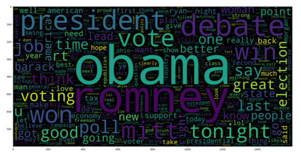
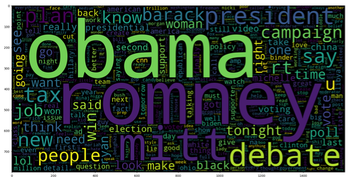
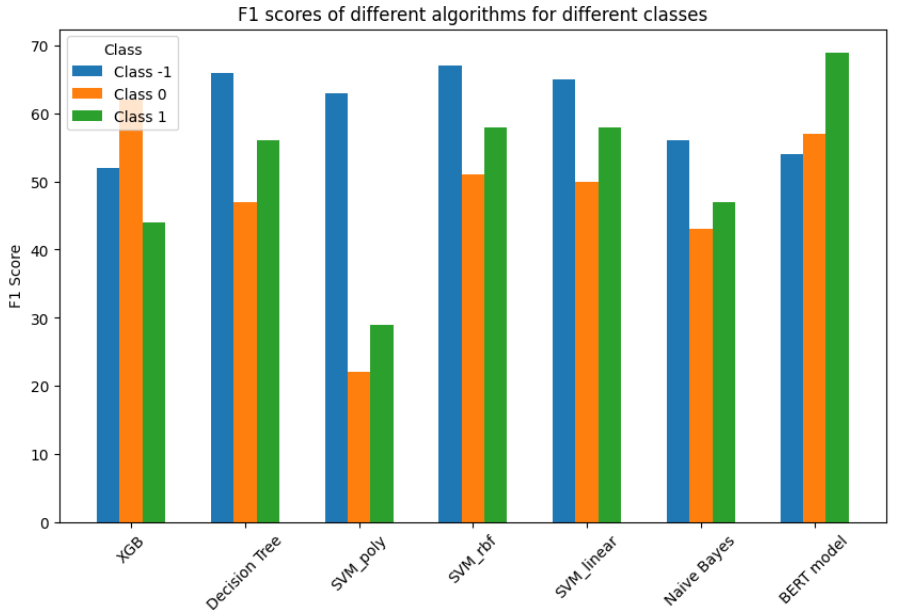
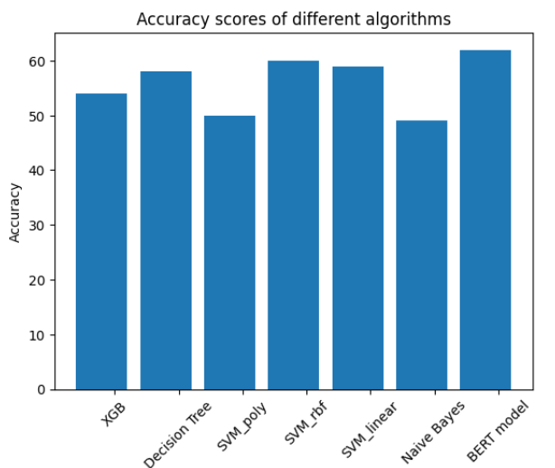

# Deep Sentiment Analysis Project
## Project Overview
This project delves into the realm of sentiment analysis, specifically focusing on three-class sentiment classification of Twitter data.
Word cloud for negative Tweets              |         Word cloud for positive Tweets  
:-------------------------:|:-------------------------:
  |  

## Project Highlights
* Data Analysis and Preprocessing: Extensive data analysis was carried out, involving data distribution analysis, data cleaning, preprocessing, and feature extraction. This phase also included stopword removal and text normalization for enhancing the quality of the dataset.

* Text Vectorization Techniques: Various text vectorization techniques were explored, including TF-IDF, Bag of Words, Word2Vec, and BERT embeddings. Additionally, one-hot encoding was applied for categorical data derived from dates and times, ensuring comprehensive data representation.

* Machine Learning Models: The project involved an in-depth exploration of various machine learning models, such as Support Vector Machine (SVM), Naive Bayes, Decision Tree, Extreme Gradient Boosting (XGBoost), and a Neural Network based on BERT embeddings. Each model was employed for sentiment classification.

* Hyperparameter Optimization: Hyperparameter optimization was carried out for each classifier using a grid search methodology and 10-fold cross-validation, ensuring that the models achieved their optimal performance.

## Project Contributions
* Performing three-class sentiment analysis on Twitter data, handling data cleaning, preprocessing, and feature extraction.
* Investigating and implementing diverse text vectorization techniques for a comprehensive understanding of text data.
* Exploring and applying multiple machine learning models for sentiment classification, including SVM, Naive Bayes, Decision Tree, XGBoost, and a Neural Network based on BERT embeddings.
* Optimizing hyperparameters for each classifier through grid search and cross-validation, ensuring that the models were finely tuned for their classification tasks.

## Analysis of result
The following charts summarize the main results.

F1 score            |  Accuracy
:-------------------------:|:-------------------------:
  |  

---

Please check the following [link](/Report.pdf) for the complete report.
